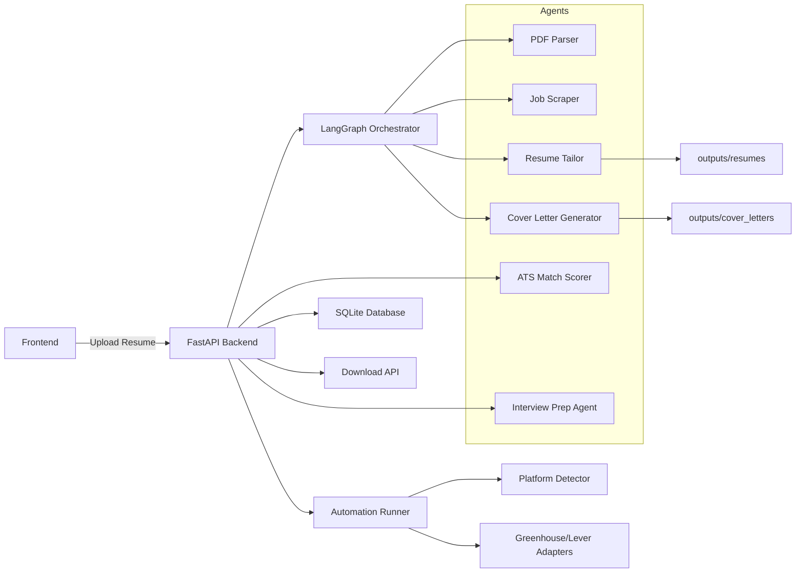

# Job Application Agent

## Project Overview
Job Application Agent is an AI-powered job application automation system that helps job seekers streamline the application process. The system accepts a resume and job preferences, searches for relevant jobs, tailors the resume for each job description, generates personalized cover letters, and prepares application-ready documents.

## Key Objectives
- Automate repetitive application tasks: tailoring resumes and generating targeted cover letters.
- Provide an easy upload and monitor UI with a stable API.
- Keep the system usable without LLM keys by providing safe fallbacks.

## Benefits To Job Seekers
- Saves time by creating tailored resumes and cover letters at scale.
- Improves ATS compatibility by mirroring job description keywords.
- Tracks generated artifacts per upload session for easy download.

## Features
- Resume upload and parsing (PDF)
- Job scraping and filtering (optional SerpApi) with ATS-aware job fetching
- Resume tailoring per job (PDF output)
- Cover letter generation (DOCX output)
- ATS match scoring - resume-to-job fit preview with a score badge in the dashboard
- Interview prep agent - generates likely interview questions and prep notes per job
- Application Autofill Assist - detects Greenhouse/Lever ATS platforms and autofills application forms via a non-headless Playwright browser (never auto-submits)
- Session and job tracking (SQLite)
- Email and Telegram alert subscription management
- Search History and Manage Alerts pages for reviewing prior runs and notification logs
- LLM-powered flows with safe fallbacks when keys are not configured

## Architecture



## Component Descriptions
- `backend/api/main.py` - FastAPI app entrypoint, CORS, and lifespan lifecycle (starts DB, directories, and alert scheduler).
- `backend/api/routes/upload.py` - Upload endpoint; starts the background pipeline and inserts a session record.
- `backend/api/routes/jobs.py` - Retrieves jobs for a session, job detail, and search-history endpoints.
- `backend/api/routes/sessions.py` - Adds resume experience/context to an existing session.
- `backend/api/routes/download.py` - Serves generated files with path-safety checks.
- `backend/api/routes/alerts.py` - Alert subscription, notification history, and preference management endpoints.
- `backend/api/routes/ats_match.py` - Computes and retrieves ATS resume-to-job match scores.
- `backend/api/routes/interview_prep.py` - Generates and retrieves interview prep content for a job.
- `backend/api/routes/automation.py` - Checks autofill platform support and triggers the autofill runner for a job.
- `backend/alerts/job_checker.py` - Daily scheduler that fetches matching jobs and dispatches email/Telegram alerts.
- `backend/alerts/notifier_email.py` - Sends multipart plain-text plus HTML email digests for new job matches.
- `backend/orchestrator/graph.py` - Builds the LangGraph pipeline coordinating agents.
- `backend/agents/pdf_parser.py` - Extracts text and structured resume data (Groq optional, heuristic fallback).
- `backend/agents/scraper_agent.py` - Fetches and normalizes job listings using SerpApi (optional).
- `backend/agents/ats_job_fetcher.py` - Fetches ATS-hosted job postings for scoring/autofill flows.
- `backend/agents/tailor_agent.py` - Tailors resume content and writes tailored PDFs (ReportLab).
- `backend/agents/cover_letter_agent.py` - Generates cover letters (.docx) with advanced prompt or fallback template.
- `backend/agents/interview_prep_agent.py` - Produces interview questions/prep notes from job + resume context.
- `backend/agents/relevance_scorer.py` / `skill_extractor.py` / `role_inferrer.py` / `job_validator.py` - Support scoring, skill extraction, role inference, and job-listing validation.
- `backend/utils/ats_scorer.py` - Computes resume-to-job ATS match scores.
- `backend/automation/platform_detector.py` - Detects the ATS platform (Greenhouse/Lever) for a job URL.
- `backend/automation/runner.py` - Launches a non-headless Playwright browser and delegates form filling to the matching adapter; never submits.
- `backend/automation/adapters/` - `greenhouse.py` and `lever.py` adapters implementing platform-specific form fill logic.
- `backend/utils/db.py` - SQLite helpers and schema initialization (`backend/data/jobs.db`).
- `backend/utils/file_helpers.py` - Output directory initialization, filename sanitization, and safe path helpers.

## Agent Workflow
1. User uploads a PDF resume via the frontend or `POST /api/upload`.
2. Backend saves the file and creates a `session_id`.
3. Orchestrator pipeline runs: PDF parse, job scrape, resume tailoring, and cover letter generation.
4. Tailored resumes and cover letters are written to `backend/outputs/resumes/` and `backend/outputs/cover_letters/`.
5. Jobs and file paths are inserted into the SQLite DB and become accessible via `GET /api/jobs`.

## Technology Stack
- Frontend: React 18, Vite, Axios, Tailwind CSS
- Backend: Python, FastAPI, Uvicorn
- Agents: Groq (optional LLM client), pypdf/pymupdf, reportlab, python-docx, requests, httpx
- Automation: Playwright (Application Autofill Assist)
- Scheduling: APScheduler (daily alert digests)
- Database: SQLite (local)

## Project Structure
- `backend/` - backend application and agents
  - `api/` - FastAPI app and `routes/` (upload, jobs, sessions, download, alerts, ats_match, interview_prep, automation)
  - `agents/` - `pdf_parser.py`, `scraper_agent.py`, `ats_job_fetcher.py`, `tailor_agent.py`, `cover_letter_agent.py`, `interview_prep_agent.py`, `relevance_scorer.py`, `skill_extractor.py`, `role_inferrer.py`, `job_validator.py`
  - `automation/` - `platform_detector.py`, `runner.py`, `adapters/` (`greenhouse.py`, `lever.py`)
  - `orchestrator/` - graph and state
  - `alerts/` - `scheduler.py`, `job_checker.py`, `notifier_email.py`, `notifier_telegram.py`, `cleanup.py`
  - `utils/` - `db.py`, `file_helpers.py`, `ats_scorer.py`, `groq_client.py`
  - `outputs/` - runtime-generated `resumes/` and `cover_letters/`
  - `data/` - runtime SQLite DB file `jobs.db`
  - `tests/` - pytest suite covering agents, routes, adapters, and utils
  - `run.py` - helper script to start the server
  - `requirements.txt` - Python dependencies
- `frontend/` - React + Vite application
  - `src/api/agentApi.js` - client wrapper for backend endpoints
  - `src/components/` - UI components
  - `src/pages/` - app pages: Home, Dashboard, JobDetail, SearchHistory, and ManageAlerts
  - `package.json` - JS dependencies and scripts

## Installation Guide
### Prerequisites
- Python 3.10+ (backend)
- Node.js 18+ (frontend)
- pip, npm/yarn
- Optional: `GROQ_API_KEY` for LLM features
- Optional: `SERPAPI_KEY` for job scraping

### Clone Repository
```bash
git clone <repo-url>
cd job_application_agent
```

### Backend Setup
```bash
cd backend
python -m venv .venv
# Windows PowerShell
.venv\Scripts\activate
pip install -r requirements.txt
```

### Frontend Setup
```bash
cd frontend
npm install
# or
# yarn
```

## Environment Variables
Example backend `.env`:
```env
PORT=8000
GROQ_API_KEY=your_groq_api_key_here
SERPAPI_KEY=your_serpapi_key_here
SMTP_USER=your_smtp_username
SMTP_PASSWORD=your_smtp_password
SMTP_FROM=alerts@example.com
```

### Description Of Variables
- `PORT`: Backend port, default `8000`.
- `GROQ_API_KEY`: Groq LLM API key; optional. Agents fall back to heuristics/templates when absent.
- `SERPAPI_KEY`: SerpApi key for job scraping; optional. When absent, scraper returns an empty job list.
- `SMTP_USER`, `SMTP_PASSWORD`, `SMTP_FROM`: Required for daily email digests.

## Running
### Run Backend
```bash
cd backend
python run.py
# or
uvicorn api.main:app --reload --host 0.0.0.0 --port 8000
```

### Run Frontend
```bash
cd frontend
npm run dev
```

## Usage Guide
1. Open the frontend in the browser.
2. Upload your resume (PDF), enter `role` and `location`, and submit.
3. The frontend receives a `session_id` and polls `GET /api/jobs?session_id=<id>`.
4. When complete, download tailored resume PDFs and cover letters from the dashboard or `GET /api/download?file=<filename>`.
5. Use Search History to reopen prior runs and Manage Alerts to inspect alert subscriptions and notification history.

## API Endpoints
- `POST /api/upload` - Upload PDF resume and start processing.
- `GET /api/jobs?session_id=<id>` - Get list of jobs for a session.
- `GET /api/jobs/{job_id}` - Get job details.
- `GET /api/search-history` / `GET /api/search-history/{session_id}` - List or fetch prior search sessions.
- `DELETE /api/search-history/{session_id}` / `DELETE /api/search-history` - Delete one or all search history entries.
- `POST /api/sessions/{session_id}/experience` - Add resume experience/context to a session.
- `GET /api/download?file=<filename>` - Download generated file.
- `POST /api/alerts/subscribe` - Create a new email/Telegram alert preference.
- `PUT /api/alerts/preferences/{pref_id}` - Update an existing alert preference.
- `PATCH /api/alerts/telegram` - Update Telegram chat ID for an alert user.
- `PATCH /api/alerts/toggle` - Enable or disable a user's alert preferences.
- `DELETE /api/alerts/preferences/{pref_id}` - Delete a saved alert preference.
- `DELETE /api/alerts/unsubscribe` - Remove a user from alert notifications.
- `GET /api/alerts/active-users` - List active alert users.
- `GET /api/alerts/history?email=<address>` - Retrieve notification history for an alert email.
- `POST /api/jobs/{job_id}/ats-match` - Compute an ATS resume-to-job match score.
- `GET /api/jobs/{job_id}/ats-match` - Retrieve a previously computed ATS match score.
- `POST /api/jobs/{job_id}/interview-prep` - Generate interview prep content for a job.
- `GET /api/jobs/{job_id}/interview-prep` - Retrieve generated interview prep content.
- `GET /api/jobs/{job_id}/autofill-support` - Check whether autofill is supported (Greenhouse/Lever) for a job.
- `POST /api/jobs/{job_id}/autofill` - Launch the Application Autofill Assist runner for a job.

Additional service endpoints exposed by the backend:
- `GET /` - API health and endpoint summary.
- `GET /health` - Simple health check.

### Example Upload
```bash
curl -F "file=@./my_resume.pdf" -F "role=Software Engineer" -F "location=United States" http://localhost:8000/api/upload
```

## Error Handling And Resilience
- Agents validate LLM outputs and fall back to heuristics or templates when JSON parsing fails or LLM keys are missing.
- Background pipeline errors are logged and sessions are marked `failed` in the DB.
- Orchestrator includes simple `time.sleep` delays to reduce API pressure; add rate limiters for production.
- Daily alerts are queued and sent as multipart emails with a plain-text fallback and responsive HTML body.

## Logging
- Uses Python `logging` across backend modules. FastAPI logs application lifecycle events.

## Challenges And Solutions
- Resume parsing: provides Groq-based extraction with a robust heuristic fallback.
- LLM hallucinations: responses are validated and rejected if malformed; fallback templates are used.
- Rate limiting: simple delays in orchestrator; more robust backoff strategies recommended for production.

## Future Enhancements
- Broader ATS platform coverage beyond Greenhouse/Lever for autofill
- Auto-application submission (currently autofill-only, never submits)
- Analytics dashboard and job recommendation engine

## Security Considerations
- Protect resume privacy: current storage is local under `backend/outputs/`; consider retention policies or encryption before production.
- Store API keys in environment variables; never commit secrets.
- Migrate from SQLite to a managed DB for production deployments.

## Contributing
- Fork, create feature branches, and open pull requests. Keep PRs focused and include tests for significant logic.

## License
- Add your preferred open-source license here.

## Acknowledgements
- Built with FastAPI, LangGraph orchestration, and example LLM prompts and fallbacks.
